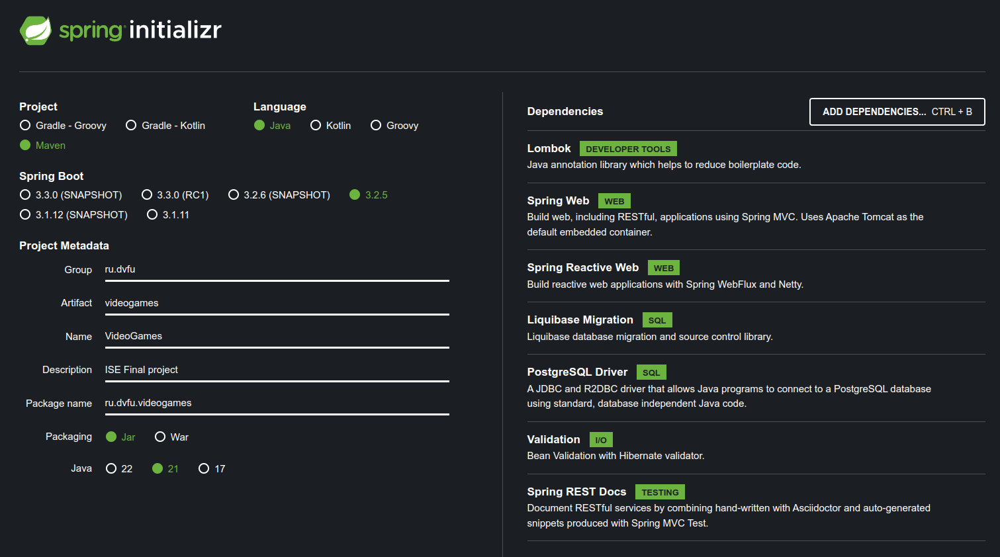

# Video games [Backend]

## Создание проекта

Есть несколько способов создания Spring Boot проекта, был использован классический способ:

1. Перейти на сайт https://start.spring.io.
2. Настроить проект под свои нужды.

   Использованные настройки:
   

    - Project: **maven** - наиболее часто используемый сборщик проектов на Java.
    - Language: **Java** - наиболее часто используемый ЯП для Spring Boot проектов.
    - Spring Boot: **3.2.5** - последняя стабильная версия на данный момент.
    - Project Metadata - доп. информация о проекте.
    - Packaging: **Jar** - наиболее часто используемый способ пакетирования Java-приложений.
    - Java: **21** - последняя LTS-версия Java на данный момент.
    - Dependencies:
        * **Lombok** - эта зависимость помогает уменьшить повторяющийся код в Java-приложениях за счёт использования
          аннотаций. Она автоматически создаёт методы, конструкторы и другие элементы кода, что делает код более
          читаемым и компактным.
        * **Spring Web** - эта зависимость позволяет создавать веб-приложения с использованием Spring MVC. Она включает
          в себя Apache Tomcat в качестве встроенного контейнера, что облегчает разработку и развёртывание
          веб-приложений.
        * **Spring Reactive Web** - эта зависимость предназначена для создания реактивных веб-приложений с помощью
          Spring WebFlux и Netty. Реактивные приложения обрабатывают запросы асинхронно и могут легко масштабироваться.
        * **Liquibase Migration** - эта зависимость используется для управления миграциями базы данных с помощью
          Liquibase. Она позволяет создавать и применять изменения в структуре базы данных с помощью файла конфигурации,
          что облегчает управление изменениями в базе данных.
        * **PostgreSQL Driver** - эта зависимость предоставляет JDBC и R2DBC драйверы для подключения Java-программ к
          базе данных PostgreSQL. Она позволяет использовать стандартный Java-код для взаимодействия с базой данных
          PostgreSQL.
        * **Validation** - эта зависимость включает в себя Bean Validation с использованием Hibernate Validator. Она
          помогает проводить валидацию данных в приложении, что улучшает его надёжность и безопасность.
        * **Spring REST Docs** - эта зависимость используется для документирования RESTful-сервисов с помощью комбинации
          ручной и автоматической генерации документации с использованием Spring MVC Test. Это помогает создавать
          полезную и понятную документацию к вашему API.
3. Нажать на кнопку "Generate".
4. Скачать полученный архив.
5. Распаковать архив в удобной директории.
6. Открыть свою среду разработки (например, IntelliJ IDEA).
7. Импортировать проект в эту среду разработки.

## Entities

Нужно перенести модель БД в приложение, сделать это можно следующим образом:

1. Создать директорию `./src/main/java/ru/dvfu/videogames/entity` (все перечисленные ниже объекты лучше создавать в этом
   пакете).
2. Создать абстрактный класс `BaseEntity`, от которого будут наследоваться все остальные сущности БД:

```java
import jakarta.persistence.Column;
import jakarta.persistence.GeneratedValue;
import jakarta.persistence.GenerationType;
import jakarta.persistence.Id;
import jakarta.persistence.MappedSuperclass;
import lombok.Getter;
import lombok.NoArgsConstructor;
import lombok.Setter;
import lombok.experimental.Accessors;

import java.io.Serializable;

// Добавляет геттеры всех аттрибутов класса
@Getter
// Добавляет сеттеры всех аттрибутов класса
@Setter
// Добавляет пустой конструктор класса
@NoArgsConstructor
// Модифицирует сеттеры, делая this возвращаемым объектом
@Accessors(chain = true)
// Помечает данный класс суперклассом для сущностей
@MappedSuperclass
public abstract class BaseEntity implements Serializable {

    // Помечает аттрибут как идентификатор записей в таблице
    @Id
    // Стратегия генерации значения AUTO
    @GeneratedValue(strategy = GenerationType.IDENTITY)
    // Помечает аттрибут как NOT NULL
    @Column(nullable = false)
    private Long id;

}
```

3. Создать сущность (класс) `Genre`:

```java
import jakarta.persistence.Column;
import jakarta.persistence.Entity;
import lombok.AllArgsConstructor;
import lombok.Builder;
import lombok.Getter;
import lombok.NoArgsConstructor;
import lombok.Setter;
import lombok.ToString;
import lombok.experimental.Accessors;

@Getter
@Setter
@AllArgsConstructor
@NoArgsConstructor
@Accessors(chain = true)
// Добавляет человеко-читаемый вывод объекта переопределением метода toString
@ToString
// Добавляет билдер объекта
@Builder
// Помечает класс как сущность
@Entity
public class Genre extends BaseEntity {

    // Идентификатор сущности возьмется из BaseEntity и будет одинаковым для всех наследуемых сущностей

    // Помечает аттрибут как NOT NULL UNIQUE
    @Column(nullable = false, unique = true)
    private String name;

}
```

4. Создать сущности `Publisher` и `Platfrom` по аналогии с `Genre`.
5. Создать сущность `Game`:

```java
import jakarta.persistence.Column;
import jakarta.persistence.Entity;
import jakarta.persistence.JoinColumn;
import jakarta.persistence.ManyToOne;
import lombok.AllArgsConstructor;
import lombok.Builder;
import lombok.Getter;
import lombok.NoArgsConstructor;
import lombok.Setter;
import lombok.ToString;
import lombok.experimental.Accessors;

import java.io.Serializable;

@Getter
@Setter
@NoArgsConstructor
@AllArgsConstructor
@Accessors(chain = true)
@ToString
@Builder
@Entity
public class Game extends BaseEntity {

    // Помечает связь с Publisher как n:1
    @ManyToOne
    // Помечает связь с Publisher как NOT NULL
    @JoinColumn(nullable = false)
    private Publisher publisher;

    // Помечает связь с Genre как n:1
    @ManyToOne
    // Помечает связь с Genre как NOT NULL
    @JoinColumn(nullable = false)
    private Genre genre;

    @Column(nullable = false)
    private String name;

}
```

6. Создать сущность `ReleasedGame` по аналогии с `Game` (для `ReleasedGame.year` взять тип `Integer`).
7. Создать перечисление `Region`:

```java
public enum Region {

    NA,
    EU,
    JP,
    GLOBAL,
    OTHER

}
```

8. Создать сущность `Sale`:

```java

@Getter
@Setter
@NoArgsConstructor
@Accessors(chain = true)
@ToString
@Builder
@Entity
public class Sale extends BaseEntity {

    @ManyToOne
    @JoinColumn(nullable = false)
    private ReleasedGame releasedGame;

    @Column(nullable = false)
    // Сохранение и чтение аттрибута будет по строковому значению перечисления
    @Enumerated(EnumType.STRING)
    private Region region;

    @Column(nullable = false)
    private Double numberOfSales;

}
```

## Миграция данных

В качестве менеджера миграций был выбран Liquibase. Для того чтобы загрузить в БД все данные при запуске приложения
будем использовать именно его. Для этого нужно создать в ресурсах приложения Master Changelog:

1. Перейти в директорию `./src/main/resources/db/changelog`.
2. Создать файл `db.changlelog-master.xml`:

```xml
<?xml version="1.0" encoding="UTF-8"?>
<databaseChangeLog xmlns="http://www.liquibase.org/xml/ns/dbchangelog"
                   xmlns:xsi="http://www.w3.org/2001/XMLSchema-instance"
                   xsi:schemaLocation="http://www.liquibase.org/xml/ns/dbchangelog http://www.liquibase.org/xml/ns/dbchangelog/dbchangelog-4.1.xsd">
    <include file="/db/changelog/0.0.1/db.changelog-create-model.xml"/>
    <include file="/db/changelog/0.0.1/db.changelog-insert-genre.xml"/>
    <include file="/db/changelog/0.0.1/db.changelog-insert-platform.xml"/>
    <include file="/db/changelog/0.0.1/db.changelog-insert-publisher.xml"/>
    <include file="/db/changelog/0.0.1/db.changelog-insert-game.xml"/>
    <include file="/db/changelog/0.0.1/db.changelog-insert-released-game.xml"/>
    <include file="/db/changelog/0.0.1/db.changelog-insert-sale.xml"/>
</databaseChangeLog>
```

В этом файле перечислены все миграции, необходимые для запуска приложения. Теперь нужно создать эти файлы миграции,
перечисленные выше:

1. Создать файл `/db/changelog/0.0.1/db.changelog-create-model.xml`:

```xml
<?xml version="1.0" encoding="UTF-8"?>
<databaseChangeLog xmlns="http://www.liquibase.org/xml/ns/dbchangelog"
                   xmlns:xsi="http://www.w3.org/2001/XMLSchema-instance"
                   xsi:schemaLocation="http://www.liquibase.org/xml/ns/dbchangelog http://www.liquibase.org/xml/ns/dbchangelog/dbchangelog-4.1.xsd">

    <changeSet id="create_genre_table" author="<your name>">
        <createTable tableName="genre">
            <column name="id" type="bigint" autoIncrement="true">
                <constraints nullable="false" primaryKey="true" primaryKeyName="genre_pk"/>
            </column>
            <column name="name" type="varchar(255)">
                <constraints nullable="false" unique="true"/>
            </column>
        </createTable>
    </changeSet>

    <changeSet id="create_platform_table" author="<your name>">
        <createTable tableName="platform">
            <column name="id" type="bigint" autoIncrement="true">
                <constraints nullable="false" primaryKey="true" primaryKeyName="platform_pk"/>
            </column>
            <column name="name" type="varchar(255)">
                <constraints nullable="false" unique="true"/>
            </column>
        </createTable>
    </changeSet>

    <changeSet id="create_publisher_table" author="<your name>">
        <createTable tableName="publisher">
            <column name="id" type="bigint" autoIncrement="true">
                <constraints nullable="false" primaryKey="true" primaryKeyName="publisher_pk"/>
            </column>
            <column name="name" type="varchar(255)">
                <constraints nullable="false" unique="true"/>
            </column>
        </createTable>
    </changeSet>

    <changeSet id="create_game_table" author="<your name>">
        <createTable tableName="game">
            <column name="id" type="bigint" autoIncrement="true">
                <constraints nullable="false" primaryKey="true" primaryKeyName="game_pk"/>
            </column>
            <column name="publisher_id" type="bigint">
                <constraints references="publisher(id)" foreignKeyName="game_publisher_fk" nullable="false"/>
            </column>
            <column name="genre_id" type="bigint">
                <constraints references="genre(id)" foreignKeyName="game_genre_fk" nullable="false"/>
            </column>
            <column name="name" type="varchar(255)">
                <constraints nullable="false"/>
            </column>
        </createTable>
    </changeSet>

    <changeSet id="create_released_game_table" author="<your name>">
        <createTable tableName="released_game">
            <column name="id" type="bigint" autoIncrement="true">
                <constraints nullable="false" primaryKey="true" primaryKeyName="released_game_pk"/>
            </column>
            <column name="game_id" type="bigint">
                <constraints references="game(id)" foreignKeyName="released_game_game_fk" nullable="false"/>
            </column>
            <column name="platform_id" type="bigint">
                <constraints references="platform(id)" foreignKeyName="released_game_platform_fk" nullable="false"/>
            </column>
            <column name="year" type="integer">
                <constraints nullable="false"/>
            </column>
        </createTable>
    </changeSet>

    <changeSet id="create_sale_table" author="<your name>">
        <createTable tableName="sale">
            <column name="id" type="bigint" autoIncrement="true">
                <constraints nullable="false" primaryKey="true" primaryKeyName="sale_pk"/>
            </column>
            <column name="released_game_id" type="bigint">
                <constraints references="released_game(id)" foreignKeyName="sale_released_game_fk" nullable="false"/>
            </column>
            <column name="region" type="varchar(255)">
                <constraints nullable="false"/>
            </column>
            <column name="number_of_sales" type="float">
                <constraints nullable="false"/>
            </column>
        </createTable>
    </changeSet>

</databaseChangeLog>
```

2. Остальные файлы создать автоматизированно, например, с помощью следующего скрипта на Python:

```python
import csv


def to_changelog(changeset: str) -> str:
    return (f'<?xml version="1.0" encoding="UTF-8"?>'
            f'<databaseChangeLog xmlns="http://www.liquibase.org/xml/ns/dbchangelog"'
            f' xmlns:xsi="http://www.w3.org/2001/XMLSchema-instance"'
            f' xsi:schemaLocation="http://www.liquibase.org/xml/ns/dbchangelog http://www.liquibase.org/xml/ns/dbchangelog/dbchangelog-4.1.xsd">'
            f'{changeset}'
            f'</databaseChangeLog>')


def to_changeset(id_: str, author: str, changes: list[str]) -> str:
    return (f'<changeSet id="{id_}" author="{author}">'
            f'{"".join(changes)}'
            f'</changeSet>')


def to_genre_insert(name) -> str:
    return f'<insert tableName="genre"><column name="name" value="{name}"/></insert>'


def to_platform_insert(name) -> str:
    return f'<insert tableName="platform"><column name="name" value="{name}"/></insert>'


def to_publisher_insert(name) -> str:
    return f'<insert tableName="publisher"><column name="name" value="{name}"/></insert>'


def to_game_insert(publisher, genre, name, publishers: list, genres: list) -> str:
    return (f'<insert tableName="game">'
            f'<column name="publisher_id" value="{publishers.index(publisher) + 1}"/>'
            f'<column name="genre_id" value="{genres.index(genre) + 1}"/>'
            f'<column name="name" value="{name}"/>'
            f'</insert>')


def to_released_game_insert(publisher, genre, name, platform, year, games: list, platforms: list) -> str:
    return (f'<insert tableName="released_game">'
            f'<column name="game_id" value="{games.index((publisher, genre, name)) + 1}"/>'
            f'<column name="platform_id" value="{platforms.index(platform) + 1}"/>'
            f'<column name="year" value="{year}"/>'
            f'</insert>')


def to_sale_insert(publisher, genre, name, platform, year, na, eu, jp, global_, other, released_games: list) -> str:
    released_game_id = released_games.index((publisher, genre, name, platform, year)) + 1
    return (f'<insert tableName="sale">'
            f'<column name="released_game_id" value="{released_game_id}"/>'
            f'<column name="region" value="NA"/>'
            f'<column name="number_of_sales" value="{na}"/>'
            f'</insert>'
            f'<insert tableName="sale">'
            f'<column name="released_game_id" value="{released_game_id}"/>'
            f'<column name="region" value="EU"/>'
            f'<column name="number_of_sales" value="{eu}"/>'
            f'</insert>'
            f'<insert tableName="sale">'
            f'<column name="released_game_id" value="{released_game_id}"/>'
            f'<column name="region" value="JP"/>'
            f'<column name="number_of_sales" value="{jp}"/>'
            f'</insert>'
            f'<insert tableName="sale">'
            f'<column name="released_game_id" value="{released_game_id}"/>'
            f'<column name="region" value="GLOBAL"/>'
            f'<column name="number_of_sales" value="{global_}"/>'
            f'</insert>'
            f'<insert tableName="sale">'
            f'<column name="released_game_id" value="{released_game_id}"/>'
            f'<column name="region" value="OTHER"/>'
            f'<column name="number_of_sales" value="{other}"/>'
            f'</insert>')


def get_data(path: str, delimiter=',', quotechar='"') -> list[tuple]:
    with open(path, newline='') as csv_file:
        reader = csv.reader(csv_file, delimiter=delimiter, quotechar=quotechar)
        next(reader)
        return list(set(tuple(d[1:]) for d in reader if 'N/A' not in d))


def save_changelog(path: str, id_: str, author: str, changes: list[str]) -> None:
    with open(path, 'w') as changelog_file:
        changelog_file.write(to_changelog(to_changeset(id_, author, changes)))


if __name__ == '__main__':
    data = get_data('vgsales.csv', ',', '"')

    genres = sorted(set(d[3] for d in data))
    platforms = sorted(set(d[1] for d in data))
    publishers = sorted(set(d[4] for d in data))
    games = sorted(set((d[4], d[3], d[0]) for d in data), key=lambda d: d[2])
    released_games = sorted(set((d[4], d[3], d[0], d[1], d[2]) for d in data), key=lambda d: d[2])
    sales = sorted(set((d[4], d[3], d[0], d[1], d[2], d[5], d[6], d[7], d[9], d[8]) for d in data), key=lambda d: d[2])

    genre_changes = [to_genre_insert(g) for g in genres]
    platform_changes = [to_platform_insert(p) for p in platforms]
    publisher_changes = [to_publisher_insert(p) for p in publishers]
    game_changes = [to_game_insert(*g, publishers, genres) for g in games]
    released_game_changes = [to_released_game_insert(*rg, games, platforms) for rg in released_games]
    sale_changes = [to_sale_insert(*s, released_games) for s in sales]

    save_changelog('db.changelog-insert-genre.xml', 'insert_genre_data', 'default', genre_changes)
    save_changelog('db.changelog-insert-platform.xml', 'insert_platform_data', 'default', platform_changes)
    save_changelog('db.changelog-insert-publisher.xml', 'insert_publisher_data', 'default', publisher_changes)
    save_changelog('db.changelog-insert-game.xml', 'insert_game_data', 'default', game_changes)
    save_changelog('db.changelog-insert-released-game.xml', 'insert_released_game_data', 'default', released_game_changes)
    save_changelog('db.changelog-insert-sale.xml', 'insert_sale_data', 'default', sale_changes)
```

3. Сохранить полученные файлы в директорию `./src/main/resources/db/changelog/0.0.1`.

## Repositories

Необходимо сделать следующие запросы (с поддержкой сортировки и пагинации):

1. получение названий всех жанров;
2. получение названий всех игровых платформ;
3. получение названий всех игровых издателей;
4. получение всех годов, которые рассматриваются в выборке;
5. получение таблицы продаж с поддержкой фильтрации по жанрам, игровым платформам, игровым издателям, годам и регионам;
6. получение данных для графика продаж по жанрам, игровым платформам и игровым издателям с поддержкой фильтрации по
   жанрам, игровым платформам, игровым издателям, годам и регионам.

Для реализации первых трех запросов необходимо лишь создать репозитории:

1. Создать специальный пакет `repostiory`.
2. Создать для каждой сущности репозиторий по аналогии:

```java
import org.springframework.data.jpa.repository.JpaRepository;
import org.springframework.stereotype.Repository;
import ru.dvfu.videogames.entity.Genre;

@Repository
public interface GenreRepository extends JpaRepository<Genre, Long> {
}
```

Для реализации четвертого запроса необходимо в `ReleasedGameRepository` создать следующий метод:

```java

@Query("SELECT DISTINCT rg.year " +   // Вызываемый запрос к БД в виде специального языка JPQL
        "FROM ReleasedGame rg " +
        "WHERE rg.year IS NOT NULL")
Page<Integer> findDistinctYearsNotNull(Pageable pageable);
```

Для реализации пятого запроса необходимо в `SaleRepository` создать следующие метод:

```java

@Query("SELECT s " +
        "FROM Sale s " +
        "WHERE (:#{#publishers.isEmpty()} = TRUE OR s.releasedGame.game.publisher.name IN :publishers) " +
        "  AND (:#{#platforms.isEmpty()} = TRUE OR s.releasedGame.platform.name IN :platforms) " +
        "  AND (:#{#genres.isEmpty()} = TRUE OR s.releasedGame.game.genre.name IN :genres) " +
        "  AND (:#{#years.isEmpty()} = TRUE OR s.releasedGame.year IN :years) " +
        "  AND (:#{#regions.isEmpty()} = TRUE OR s.region IN :regions)")
Page<Sale> findByPublishersAndPlatformsAndGenresAndYearsAndRegions(Collection<String> publishers,
                                                                   Collection<String> platforms,
                                                                   Collection<String> genres,
                                                                   Collection<Integer> years,
                                                                   Collection<Region> regions,
                                                                   Pageable pageable);
```

Для реализации шестого запроса необходимо создать модель для хранения данных графика (желательно, в пакете `model`):

```java
import lombok.AllArgsConstructor;
import lombok.Builder;
import lombok.Data;
import lombok.NoArgsConstructor;
import lombok.experimental.Accessors;

@Data
// Автоматически создает сеттеры, геттеры, конструкторы, человеко-читаемый вывод и переопределяет методы equals и hashCode
@Builder
@AllArgsConstructor
@Accessors(chain = true)
public class ChartData {

    private Integer year;

    private String groupBy;

    private Double numberOfSales;

}
```

После чего можно создавать следующие методы в `SaleRepository`:

```java

@Query("SELECT new ru.dvfu.videogames.model.ChartData( " +
        "          s.releasedGame.year, " +
        "          s.releasedGame.game.publisher.name, " +
        "          CASE WHEN (:aggregator = 'SUM') THEN SUM(s.numberOfSales) " +
        "               WHEN (:aggregator = 'MIN') THEN MIN(s.numberOfSales) " +
        "               WHEN (:aggregator = 'MAX') THEN MAX(s.numberOfSales) " +
        "               ELSE CAST(AVG(s.numberOfSales) AS DOUBLE) " +
        "          END " +
        "      ) " +
        "FROM Sale s " +
        "WHERE (:#{#publishers.isEmpty()} = TRUE OR s.releasedGame.game.publisher.name IN :publishers) " +
        "  AND (:#{#platforms.isEmpty()} = TRUE OR s.releasedGame.platform.name IN :platforms) " +
        "  AND (:#{#genres.isEmpty()} = TRUE OR s.releasedGame.game.genre.name IN :genres) " +
        "  AND (:#{#years.isEmpty()} = TRUE OR s.releasedGame.year IN :years) " +
        "  AND (:#{#regions.isEmpty()} = TRUE OR s.region IN :regions) " +
        "GROUP BY s.releasedGame.year, s.releasedGame.game.publisher.name ")
Page<ChartData> findByPublishersAndPlatformsAndGenresAndYearsAndRegionsGroupByPublisher(
        String aggregator,
        Collection<String> publishers,
        Collection<String> platforms,
        Collection<String> genres,
        Collection<Integer> years,
        Collection<Region> regions,
        Pageable pageable
);

@Query("SELECT new ru.dvfu.videogames.model.ChartData( " +
        "          s.releasedGame.year, " +
        "          s.releasedGame.platform.name, " +
        "          CASE WHEN (:aggregator = 'SUM') THEN SUM(s.numberOfSales) " +
        "               WHEN (:aggregator = 'MIN') THEN MIN(s.numberOfSales) " +
        "               WHEN (:aggregator = 'MAX') THEN MAX(s.numberOfSales) " +
        "               ELSE CAST(AVG(s.numberOfSales) AS DOUBLE) " +
        "          END " +
        "      ) " +
        "FROM Sale s " +
        "WHERE (:#{#publishers.isEmpty()} = TRUE OR s.releasedGame.game.publisher.name IN :publishers) " +
        "  AND (:#{#platforms.isEmpty()} = TRUE OR s.releasedGame.platform.name IN :platforms) " +
        "  AND (:#{#genres.isEmpty()} = TRUE OR s.releasedGame.game.genre.name IN :genres) " +
        "  AND (:#{#years.isEmpty()} = TRUE OR s.releasedGame.year IN :years) " +
        "  AND (:#{#regions.isEmpty()} = TRUE OR s.region IN :regions) " +
        "GROUP BY s.releasedGame.year, s.releasedGame.platform.name ")
Page<ChartData> findByPublishersAndPlatformsAndGenresAndYearsAndRegionsGroupByPlatform(
        String aggregator,
        Collection<String> publishers,
        Collection<String> platforms,
        Collection<String> genres,
        Collection<Integer> years,
        Collection<Region> regions,
        Pageable pageable
);

@Query("SELECT new ru.dvfu.videogames.model.ChartData( " +
        "          s.releasedGame.year, " +
        "          s.releasedGame.game.genre.name, " +
        "          CASE WHEN (:aggregator = 'SUM') THEN SUM(s.numberOfSales) " +
        "               WHEN (:aggregator = 'MIN') THEN MIN(s.numberOfSales) " +
        "               WHEN (:aggregator = 'MAX') THEN MAX(s.numberOfSales) " +
        "               ELSE CAST(AVG(s.numberOfSales) AS DOUBLE) " +
        "          END " +
        "      ) " +
        "FROM Sale s " +
        "WHERE (:#{#publishers.isEmpty()} = TRUE OR s.releasedGame.game.publisher.name IN :publishers) " +
        "  AND (:#{#platforms.isEmpty()} = TRUE OR s.releasedGame.platform.name IN :platforms) " +
        "  AND (:#{#genres.isEmpty()} = TRUE OR s.releasedGame.game.genre.name IN :genres) " +
        "  AND (:#{#years.isEmpty()} = TRUE OR s.releasedGame.year IN :years) " +
        "  AND (:#{#regions.isEmpty()} = TRUE OR s.region IN :regions) " +
        "GROUP BY s.releasedGame.year, s.releasedGame.game.genre.name ")
Page<ChartData> findByPublishersAndPlatformsAndGenresAndYearsAndRegionsGroupByGenre(
        String aggregator,
        Collection<String> publishers,
        Collection<String> platforms,
        Collection<String> genres,
        Collection<Integer> years,
        Collection<Region> regions,
        Pageable pageable
);
```

## Services

Теперь нужно написать слой бизнес-логики. Для этого создадим пакет `service` и проделаем следующие шаги:
1. Создать `GenreService`:
```java
import lombok.RequiredArgsConstructor;
import org.springframework.data.domain.Page;
import org.springframework.data.domain.Pageable;
import org.springframework.stereotype.Service;
import ru.dvfu.videogames.entity.Genre;
import ru.dvfu.videogames.repository.GenreRepository;

// Помечает компонент как сервис
@Service
// Создает конструктор из атрибутов с модификатором final
@RequiredArgsConstructor
public class GenreService {

    private final GenreRepository genreRepository;
    
    public Page<Genre> getAll(Pageable page) {
        return genreRepository.findAll(page);
    }

}
```
2. Создать `PlatformService` и `PublisherService` по аналогии с `GenreService`.
3. Создать `ReleasedGameService`:
```java
import lombok.RequiredArgsConstructor;
import org.springframework.data.domain.Page;
import org.springframework.data.domain.PageImpl;
import org.springframework.data.domain.Pageable;
import org.springframework.data.domain.Sort;
import org.springframework.stereotype.Service;
import ru.dvfu.videogames.enumeration.Region;
import ru.dvfu.videogames.repository.ReleasedGameRepository;

import java.util.Arrays;
import java.util.Comparator;
import java.util.List;
import java.util.Optional;

@Service
@RequiredArgsConstructor
public class ReleasedGameService {

    private final ReleasedGameRepository releasedGameRepository;
    
    public Page<Integer> getYears(Pageable page) {
        return releasedGameRepository.findDistinctYearsNotNull(page);
    }
    
    public Page<Region> getRegions(Pageable page) {
        Comparator<Region> comparator = Optional.ofNullable(page.getSort().getOrderFor("region"))
                .map(Sort.Order::getDirection)
                .orElse(Sort.Direction.DEFAULT_DIRECTION)
                .isAscending()
                ? Comparator.naturalOrder()
                : Comparator.reverseOrder();

        List<Region> data = Arrays.stream(Region.values())
                .sorted(comparator)
                .skip((long) page.getPageNumber() * page.getPageSize())
                .limit(page.getPageSize())
                .toList();

        return new PageImpl<>(data, page, Region.values().length);
    }

}
```
4. Создать перечисление `Aggregator` с экземплярами `SUM`, `MIN`, `MAX` и `MEAN`.
5. Создать перечисление `GroupBy` с экземплярами `GENRE`, `PLATFORM` и `PUBLISHER`.
6. Создать модель `Filter` с фильтрами `List<String> genre`, `List<String> platforms`, `List<String> publishers`, `List<Integer> years` и `List<Region> regions`.
7. Создать `SaleService`:
```java
import lombok.RequiredArgsConstructor;
import org.springframework.cache.annotation.Cacheable;
import org.springframework.data.domain.Page;
import org.springframework.data.domain.Pageable;
import org.springframework.stereotype.Service;
import ru.dvfu.videogames.entity.Sale;
import ru.dvfu.videogames.enumeration.Aggregator;
import ru.dvfu.videogames.enumeration.GroupBy;
import ru.dvfu.videogames.model.ChartData;
import ru.dvfu.videogames.model.Filter;
import ru.dvfu.videogames.repository.SaleRepository;

@Service
@RequiredArgsConstructor
public class SaleService {

    private final SaleRepository saleRepository;
    
    public Page<Sale> getAll(Pageable page) {
        return saleRepository.findAll(page);
    }
    
    public Page<Sale> getAll(Pageable page, Filter filter) {
        return saleRepository.findByPublishersAndPlatformsAndGenresAndYearsAndRegions(
                filter.getPublishers(),
                filter.getPlatforms(),
                filter.getGenres(),
                filter.getYears(),
                filter.getRegions(),
                page
        );
    }
    
    public Page<ChartData> getChart(Pageable page, Filter filter, Aggregator aggregator, GroupBy groupBy) {
        if (groupBy.equals(GroupBy.PUBLISHER)) {
            return saleRepository.findByPublishersAndPlatformsAndGenresAndYearsAndRegionsGroupByPublisher(
                    aggregator.name(),
                    filter.getPublishers(),
                    filter.getPlatforms(),
                    filter.getGenres(),
                    filter.getYears(),
                    filter.getRegions(),
                    page
            );
        } else if (groupBy.equals(GroupBy.PLATFORM)) {
            return saleRepository.findByPublishersAndPlatformsAndGenresAndYearsAndRegionsGroupByPlatform(
                    aggregator.name(),
                    filter.getPublishers(),
                    filter.getPlatforms(),
                    filter.getGenres(),
                    filter.getYears(),
                    filter.getRegions(),
                    page
            );
        } else {
            return saleRepository.findByPublishersAndPlatformsAndGenresAndYearsAndRegionsGroupByGenre(
                    aggregator.name(),
                    filter.getPublishers(),
                    filter.getPlatforms(),
                    filter.getGenres(),
                    filter.getYears(),
                    filter.getRegions(),
                    page
            );
        }
    }

}
```

## Data Transfer Objects

Для отправки данных клиенту и получения их от клиента используются DTO (Data Transfer Object), чтобы создать
дополнительный слой абстракции и не раскрывать клиенту используемые внутри приложения модели (например, устройство
модели БД).

Создадим базовые DTO:

1. Создать специальный пакет `dto`, чтобы сохранять внутри этого пакета все необходимые DTO.
2. Создать `PageDto<T>` с необходимыми полями пагинации для отображения (`Integer page`, `Integer size`,
   `Integer totalPages`, `Long totalElements`, `List<T> data`).
3. Создать `PageParamsDto` с необходимыми полями для параметризации пагинации со стороны клиента (`Integer page`,
   `Integer size`).
4. Создать `SortParamsDto` с необходимыми полями для параметризации многоуровневой сортировки со стороны клиента
   (`List<String> sort`, где каждая строка отвечает формату `<direction>-<field>`).
5. Создать `FilterParamsDto` с необходимыми полями для параметризации фильтрации со стороны клиента
   (`List<String> publishers`, `List<String> platforms`, `List<String> genres`, `List<String> years`,
   `List<String> regions`).

Теперь нужно создать следующие DTO, связанные с сущностями БД:

1. Создать `GenreDto`, `PlatformDto` и `PublisherDto` с полями `Long id` и `String name`.
2. Создать `ReleasedGameDto` с полями `Long id`, `Long gameId`, `Long platformId` и `Integer year`.
3. Создать `SaleDto` с полями `Long id`, `Long releasedGameId`, `String region` и `Double numberOfSales`.
4. Создать `SaleExtendedDto` с полями `Long id`, `String name`, `Integer year`, `String platform`, `String genre`,
   `String publisher`, `String region` и `Double numberOfSales`.
5. Создать `ChartDataDto` с полями `Integer year`, `String groupBy` и `Double numberOfSales`.

## Mappers

Теперь для того, чтобы конвертировать объекты из одного слоя абстракции в другой (например, из DTO в Entity и наоборот),
нужно настроить так называемые мапперы.

Будем пользоваться библиотекой `mapstruct`, которая сделает много муторного за нас. Для этого нужно добавить следующую
зависимость (в `pom.xml:project.dependencies`):

```xml

<dependency>
    <groupId>org.mapstruct</groupId>
    <artifactId>mapstruct</artifactId>
</dependency>
```

Создадим мапперы следующим образом:

1. Создать интерфейс `CommonMapper`, который определит 3 важных метода для нас:

```java
import org.mapstruct.Mapping;
import org.springframework.data.domain.Page;
import ru.dvfu.videogames.dto.PageDto;
import ru.dvfu.videogames.entity.BaseEntity;

import java.util.List;

public interface CommonMapper<E extends BaseEntity, D> {

    D toDto(E entity);

    List<D> toDtos(List<E> entities);

    // Помечает, что атрибут page объекта на выходе должен браться из атрибута number объекта на вход и инкрементироваться
    @Mapping(target = "page", expression = "java(page.getNumber() + 1)")
    // Помечает, что атрибут data объекта на выходе должен браться из атрибута content объекта на вход
    @Mapping(target = "data", source = "content")
    PageDto<D> toPageDto(Page<E> page);

}
```

2. Создать `GenreMapper`:

```java
import org.mapstruct.Mapper;
import ru.dvfu.videogames.dto.GenreDto;
import ru.dvfu.videogames.entity.Genre;

// Помечает дочерний класс как Spring Component
@Mapper(componentModel = "spring")
public abstract class GenreMapper implements CommonMapper<Genre, GenreDto> {
}
```

3. Создать `PlatformMapper`, `PublisherMapper`, `ReleasedGameMapper` и `SaleMapper` по аналогии с `GenreMapper`.
4. В `ReleasedGameMapper` необходимо переопределить метод `toDto` и добавить ещё один:

```java

@Mapping(source = "game.id", target = "gameId")
@Mapping(source = "platform.id", target = "platformId")
public abstract ReleasedGameDto toDto(ReleasedGame entity);

@Mapping(target = "page", expression = "java(page.getNumber() + 1)")
@Mapping(target = "data", source = "content")
public abstract PageDto<Integer> toYearsPageDto(Page<Integer> page);
```

5. В `SaleMapper` необходимо переопределить метод `toDto` и добавить ещё несколько:

```java
@Mapping(source = "releasedGame.id", target = "releasedGameId")
public abstract SaleDto toDto(Sale entity);

@Mapping(source = "releasedGame.game.name", target = "name")
@Mapping(source = "releasedGame.year", target = "year")
@Mapping(source = "releasedGame.platform.name", target = "platform")
@Mapping(source = "releasedGame.game.genre.name", target = "genre")
@Mapping(source = "releasedGame.game.publisher.name", target = "publisher")
public abstract SaleExtendedDto toExtendedDto(Sale entity);

public abstract List<SaleExtendedDto> toExtendedDtos(List<Sale> entities);

@Mapping(target = "page", expression = "java(page.getNumber() + 1)")
@Mapping(target = "data", source = "content")
public abstract PageDto<SaleExtendedDto> toExtendedPageDto(Page<Sale> page);

@Mapping(target = "page", expression = "java(page.getNumber() + 1)")
@Mapping(target = "data", source = "content")
public abstract PageDto<ChartDataDto> toChartDataPageDto(Page<ChartData> page);
```