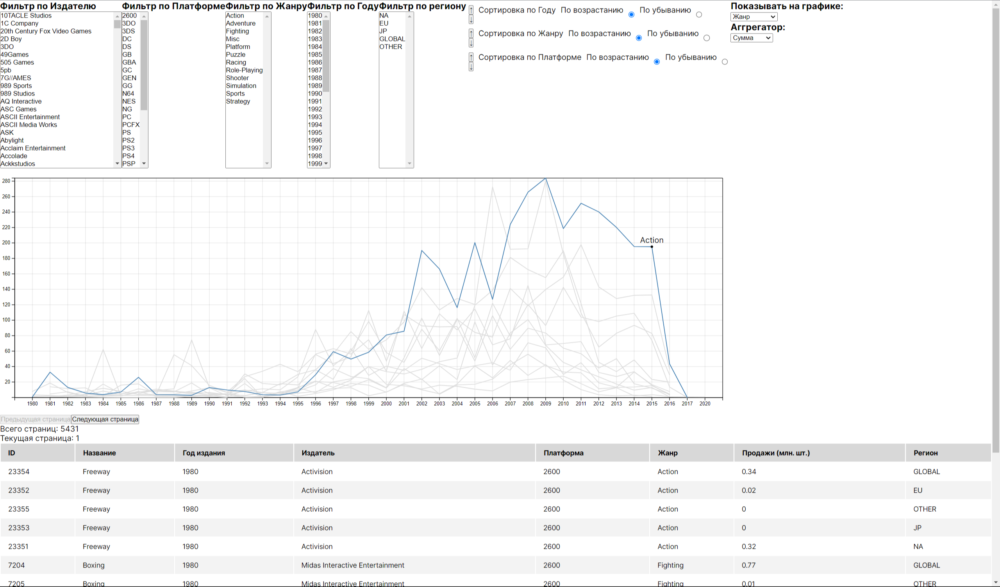

# Video games [Frontend]

## Создание проекта

Для создания приложения на Next.js с использованием TypeScript, вам необходимо выполнить следующие шаги:

- Установите Node.js, если у вас его еще нет.
- Создайте новую директорию для вашего проекта.
- Откройте терминал и перейдите в созданную директорию.
- Запустите команду `npx create-next-app@latest --typescript` для создания нового проекта Next.js с поддержкой TypeScript.
- Дождитесь завершения установки и следуйте инструкциям для настройки проекта.
- После установки зависимостей, запустите проект командой `npm run dev` или `yarn dev`.

## Компоненты

В директории `src` создадим папку с переиспользуемыми компонентами `shared`.

### Создадим первый компонент - Таблицу:

Для создания компонента Table в React с TypeScript, вам нужно создать три файла: Table.tsx, TableRows.tsx и TableHeader.tsx. Также не забудьте создать директории и файлы для стилей, если они используются.

1. Создайте директорию для компонента Table, например, `Table`.
2. В этой директории создайте файлы: Table.tsx, TableRows.tsx, TableHeader.tsx.
3. Напишите код для каждого компонента в соответствующем файле.

Пример кода для компонента Table:

Table.tsx:
```tsx
const Table = <Type, Key extends keyof Type>({
  data,
  columns
}: TableProps<Type, Key>): ReactNode => {
  return (
    <table className={s.table}>
      <TableHeader columns={columns} />
      <TableRows data={data} columns={columns} />
    </table>
  );
};

export default Table;
```

TableRows.tsx:
```tsx
const TableRows = <Type, Key extends keyof Type>({
  data,
  columns
}: TableRowsProps<Type, Key>): ReactNode => {
  return (
    <tbody className={s.tableBody}>
      {data.map((row, index) => (
        <tr key={`row${index}`}>
          {columns.map(({ key }) => (
            <td key={`${key.toString() + index}`}>{row[key] as ReactNode}</td>
          ))}
        </tr>
      ))}
    </tbody>
  );
};

export default TableRows;
```

TableHeader.tsx:
```tsx
const TableHeader = <Type, Key extends keyof Type>({
  columns
}: TableHeaderProps<Type, Key>): ReactNode => {
  return (
    <thead className={s.tableHead}>
      <tr>
        {(columns || []).map(({ name }, index) => (
          <th key={`headerCell${index}`}>{name}</th>
        ))}
      </tr>
    </thead>
  );
};

export default TableHeader;
```

Компонент таблицы готов.

### Добавим пагинацию в таблицу и назовем компонент PaginationTable:

PaginationTable.tsx:
```tsx
interface PaginationTableProps<Type, Key extends keyof Type>
	extends TableProps<Type, Key> {
	totalPages: number
	onNextPage: () => void
	onPrevPage: () => void
	currentPage: number
}

const PaginationTable = <Type, Key extends keyof Type>({
         data,
         columns,
         totalPages,
         onNextPage,
         onPrevPage,
         currentPage
     }: PaginationTableProps<Type, Key>): ReactNode => {
	return (
		<>
			<button
				disabled={currentPage === 1}
				onClick={onPrevPage}
			>
				Предыдущая страница
			</button>
			<button
				disabled={currentPage === totalPages}
				onClick={onNextPage}
			>
				Следующая страница
			</button>
			<p>Всего страниц: {totalPages}</p>
			<p>Текущая страница: {currentPage}</p>
			<Table data={data} columns={columns} />
		</>
	)
}

export default PaginationTable
```

### Добавим компоненты для фильтрации и сортировки:

```tsx
interface FilerProps<Type> {
	title: string
	data: Type[]
	onChangeHandler: (e: ChangeEvent<HTMLSelectElement>) => void
	}

	const Filter = <Type,>({ data, title, onChangeHandler }: FilerProps<Type>) => {
		return (
            <div>
                <h3>{title}</h3>
			<select multiple size={20} onChange={onChangeHandler}>
		{data.map(value => (
		<option key={value as string} value={value as string}>
			{value as ReactNode}
		</option>
		))}
		</select>
    </div>
  )
}

export default Filter
```

Filters.tsx:
```tsx
interface FiltersProps<Type, Key extends keyof Type> {
	selectedFilters: FilterObject<Type>
	filters: DataCustomNameByField<Type, Key>[]
	setSelectedFilters: (filter: FilterObject<Type>) => void
}

const Filters = <Type, Key extends keyof Type>({
	selectedFilters,
	filters,
	setSelectedFilters
}: FiltersProps<Type, Key>): ReactNode => {
	return (
		<>
			{filters.map(({ name, key, data }) => (
				<Filter
					title={name}
					data={data}
					onChangeHandler={e => {
						const selectedValues: string[] = []
						for (const option of e.currentTarget.selectedOptions) {
							selectedValues.push(option.value)
						}
						const newState = {
							...selectedFilters,
							[key]: selectedValues
						}
						setSelectedFilters(newState)
					}}
				/>
			))}
		</>
	)
}

export default Filters
```

Создание компонентов `Filter` и `Filters` имеет следующие цели:

1. **Filter**:
    - **Цель**: Компонент Filter предназначен для отображения фильтра в виде выпадающего списка, который позволяет пользователю выбирать определенные значения для фильтрации данных.
    - **Зачем**: Этот компонент позволяет создать удобный интерфейс для фильтрации данных, предоставляя пользователю возможность выбирать одно или несколько значений из списка.

2. **Filters**:
    - **Цель**: Компонент Filters используется для отображения нескольких фильтров на основе переданных данных и их обработки.
    - **Зачем**: Этот компонент позволяет группировать несколько фильтров вместе, отображая их на странице и обрабатывая выбранные пользователем значения для фильтрации данных.

Оба компонента вместе обеспечивают удобный интерфейс для фильтрации данных, позволяя пользователям выбирать определенные значения для фильтрации и обрабатывая эти выбранные значения для применения фильтров к данным.

Эти компоненты могут быть использованы в различных частях приложения для добавления функциональности фильтрации данных, что делает их универсальными и переиспользуемыми.

Аналогичные цели и у компонентов Sorter и Sorters:

Sorter.tsx:
```tsx
nterface SorterProps<Type, Key extends keyof Type> {
	keyName: Key
	name: string
	onMoveUp: () => void
		onMoveDown: () => void
	sorting: 'asc' | 'desc'
onClick: (index: number, newSorting: 'asc' | 'desc') => void
	index: number
}

const Sorter = <Type, Key extends keyof Type>({
         keyName,
         name,
         onMoveUp,
         onMoveDown,
         sorting,
         onClick,
         index
     }: SorterProps<Type, Key>) => {
	const setChecked = e => {
		onClick(index, e.target.value)
	}

	return (
		<div style={{ display: 'flex', gap: 10, margin: '10px 5px' }}>
			<div style={{ display: 'flex', flexDirection: 'column' }}>
				<button className='up-button' onClick={onMoveUp}>
					↑
				</button>
				<button className='down-button' onClick={onMoveDown}>
					↓
				</button>
			</div>
			<span>{name}</span>
			<label htmlFor={(keyName as string) + 'Asc'}>По возрастанию</label>
			<input
				id={(keyName as string) + 'Asc'}
				type='radio'
				value='asc'
				name={(keyName as string) + 'Asc'}
				checked={sorting === 'asc'}
				onClick={setChecked}
			/>
			<label htmlFor={(keyName as string) + 'Desc'}>По убыванию</label>
			<input
				id={(keyName as string) + 'Desc'}
				type='radio'
				value='desc'
				name={(keyName as string) + 'Desc'}
				checked={sorting === 'desc'}
				onClick={setChecked}
			/>
		</div>
	)
}

export default Sorter
```

Sorters.tsx:
```tsx
export interface ISorters<Type, Key extends keyof Type>
	extends DataCustomNameByField<Type, Key> {
	sorting: 'asc' | 'desc'
}

export interface SortersProps<Type, Key extends keyof Type> {
	sorters: ISorters<Type, Key>[]
	setSorters: (sorters: ISorters<Type, Key>[]) => void
}

const Sorters = <Type, Key extends keyof Type>({
          sorters,
          setSorters
      }: SortersProps<Type, Key>) => {
	const moveItem = (currentIndex: number, direction: 'up' | 'down') => {
		if (direction === 'up' && currentIndex > 0) {
			const newItems = [...sorters]
			;[newItems[currentIndex], newItems[currentIndex - 1]] = [
				newItems[currentIndex - 1],
				newItems[currentIndex]
			]
			setSorters(newItems)
		} else if (direction === 'down' && currentIndex < sorters.length - 1) {
			const newItems = [...sorters]
			;[newItems[currentIndex], newItems[currentIndex + 1]] = [
				newItems[currentIndex + 1],
				newItems[currentIndex]
			]
			setSorters(newItems)
		}
	}

	const editItem = (index: number, newSorting: 'asc' | 'desc') => {
		const newItems = [...sorters]
		newItems[index].sorting = newSorting
		setSorters(newItems)
	}

	return (
		<div>
			{sorters.map(({ key, name, sorting }, index) => (
				<Sorter
					key={key as string}
					onMoveDown={() => moveItem(index, 'down')}
					onMoveUp={() => moveItem(index, 'up')}
					keyName={key}
					name={name}
					sorting={sorting}
					onClick={editItem}
					index={index}
				/>
			))}
		</div>
	)
}

export default Sorters
```

### Добавим компонент для отрисовки графика Chart:

Chart.tsx
```tsx
interface ChartProps {
   data: any[]
   showOnChart: string
   aggregator: string
}

const Chart = ({ data = [], showOnChart, aggregator }: ChartProps) => {
   const d3Container = useRef<SVGSVGElement>(null)
   const width = 1500
   const height = 1000
   const marginTop = 20
   const marginRight = 20
   const marginBottom = 30
   const marginLeft = 30
   const animationDuration = 3000

   useEffect(() => {
      if (d3Container.current) {
         const svg = d3.select(d3Container.current)

         const xScale = d3
                 .scaleBand()
                 .domain(d3.group(data, d => d.year).keys())
                 .range([marginLeft, width - marginRight])
                 .padding(1)

         const yScale = d3
                 .scaleLinear()
                 .domain(d3.extent(data, d => d.numberOfSales))
                 .range([height - marginBottom, marginTop])

         // отрисованная ось x
         svg
                 .selectAll('g.x-axis')
                 .data([null])
                 .join(
                         enter =>
                                 enter
                                         .append('g')
                                         .attr('class', 'x-axis')
                                         .attr('transform', `translate(0, ${height - marginBottom})`),
                         update =>
                                 update
                                         .attr('transform', `translate(0, ${height - marginBottom})`)
                                         .transition()
                                         .duration(animationDuration)
                 )
                 .call(d3.axisBottom(xScale))

         // отрисованная ось y
         svg
                 .selectAll('g.y-axis')
                 .data([null])
                 .join(
                         enter =>
                                 enter
                                         .append('g')
                                         .attr('class', 'y-axis')
                                         .attr('transform', `translate(${marginLeft}, 0)`),
                         update =>
                                 update
                                         .transition()
                                         .duration(animationDuration)
                                         .attr('transform', `translate(${marginLeft}, 0)`)
                 )
                 .call(d3.axisLeft(yScale))

         function makeXGridlines() {
            return d3
                    .axisBottom(xScale)
                    .tickSize(-height + marginTop + marginBottom)
                    .tickFormat('')
         }

         function makeYGridlines() {
            return d3
                    .axisLeft(yScale)
                    .tickSize(-width + marginLeft + marginRight)
                    .tickFormat('')
         }

         if (d3.select('.x-grid').empty()) {
            // Добавление сетки оси X
            svg
                    .append('g')
                    .attr('class', 'x-grid')
                    .attr('transform', `translate(0,${height - marginBottom})`)
                    .call(makeXGridlines())
                    .selectAll('.tick line')
                    .attr('stroke-opacity', 0.1)

            // Добавление сетки оси Y
            svg
                    .append('g')
                    .attr('class', 'y-grid')
                    .attr('transform', `translate(${marginLeft},0)`)
                    .call(makeYGridlines())
                    .selectAll('.tick line')
                    .attr('stroke-opacity', 0.1)
         } else {
            updateGrid()
         }

         function updateGrid() {
            svg
                    .select('.x-grid')
                    .transition()
                    .duration(animationDuration)
                    .call(makeXGridlines())
                    .selectAll('.tick line')
                    .attr('stroke-opacity', 0.1)

            svg
                    .select('.y-grid')
                    .transition()
                    .duration(animationDuration)
                    .call(makeYGridlines())
                    .selectAll('.tick line')
                    .attr('stroke-opacity', 0.1)
         }

         const points = data.map(d => [
            xScale(d.year),
            yScale(d.numberOfSales),
            d.groupBy
         ])
         const groups = d3.rollup(
                 points,
                 v => Object.assign(v, { z: v[0][2] }),
                 d => d[2]
         )

         // отрисованные линии
         const line = d3.line()
         const linesGroup = svg
                 .selectAll('g.lines')
                 .data([null])
                 .join('g')
                 .attr('class', 'lines')

         const path = linesGroup
                 .selectAll('path')
                 .data(groups.values())
                 .join(
                         enter =>
                                 enter
                                         .append('path')
                                         .attr('class', 'line')
                                         .attr('fill', 'none')
                                         .attr('stroke', 'steelblue')
                                         .attr('stroke-width', 1.5)
                                         .attr('stroke-linejoin', 'round')
                                         .attr('stroke-linecap', 'round')
                                         .style('mix-blend-mode', 'multiply')
                                         .attr('d', line),
                         update =>
                                 update.transition().duration(animationDuration).attr('d', line),
                         exit => exit.transition().duration(animationDuration).remove()
                 )

         const dot = svg.append('g').attr('display', 'none')
         dot.append('circle').attr('r', 2.5)
         dot.append('text').attr('text-anchor', 'middle').attr('y', -8)

         svg
                 .on('pointerenter', pointerEntered)
                 .on('pointermove', pointerMoved)
                 .on('pointerleave', pointerLeft)
                 .on('touchstart', event => event.preventDefault())

         function pointerMoved(event) {
            const [xm, ym] = d3.pointer(event)
            const i = d3.leastIndex(points, ([x, y]) => Math.hypot(x - xm, y - ym))
            const [x, y, k] = points[i]
            path
                    .style('stroke', ({ z }) => (z === k ? null : '#ddd'))
                    .filter(({ z }) => z === k)
                    .raise()
            dot.attr('transform', `translate(${x},${y})`)
            dot.select('text').text(k)
            svg.property('value', data[i]).dispatch('input', { bubbles: true })
         }

         function pointerEntered() {
            path.style('mix-blend-mode', null).style('stroke', '#ddd')
            dot.attr('display', null)
         }

         function pointerLeft() {
            path.style('mix-blend-mode', 'multiply').style('stroke', null)
            dot.attr('display', 'none')
            svg.node().value = null
            svg.dispatch('input', { bubbles: true })
         }
      }
   }, [data])

   return <svg width={width} height={height} ref={d3Container}></svg>
}

export default Chart
```

## Получение данных с сервера:

Создадим папку `src/api` и файл `baseApi`, в котором укажем основной url и реализуем метод получения данных `get`.

baseApi.ts:
```tsx
const BASE_URL = 'http://localhost:8080/'

const get = async (url: string, query: string) => {
	try {
		const response = await fetch(BASE_URL + url + '?' + query, {
			method: 'GET',
		})
		return await response.json()
	} catch (error) {
		throw error
	}
}

export { get }
```

Реализуем компонент получения и отображения фильтров:

src/components/VideoGamesFilters/VideoGamesFilters.tsx:
```tsx
interface VideoGamesFiltersProps {
   setQuery: Dispatch<SetStateAction<QueryModel>>
}

const VideoGamesFilters = ({ setQuery }: VideoGamesFiltersProps) => {
   useEffect(() => {
      getGenres().then(data => setGenres(data.map(({ name }) => name)))
      getPlatforms().then(data => setPlatforms(data.map(({ name }) => name)))
      getPublishers().then(data => setPublishers(data.map(({ name }) => name)))
      getYears().then(data => setYears(data))
      getRegions().then(data => setRegions(data))
   }, [])

   const getGenres = async (): Promise<GenreModel[]> => {
      return await get('genres', '').then(data => data.data)
   }

   const getPlatforms = async (): Promise<PlatformModel[]> => {
      return await get('platforms', '').then(data => data.data)
   }

   const getPublishers = async (): Promise<PublisherModel[]> => {
      return await get('publishers', '').then(data => data.data)
   }

   const getYears = async (): Promise<number[]> => {
      return await get('released-games/years', '').then(data => data.data)
   }

   const getRegions = async (): Promise<string[]> => {
      return await get('released-games/regions', '').then(data => data.data)
   }

   const [genres, setGenres] = useState<string[]>([])
   const [publishers, setPublishers] = useState<string[]>([])
   const [platforms, setPlatforms] = useState<string[]>([])
   const [years, setYears] = useState<number[]>([])
   const [regions, setRegions] = useState<string[]>([])

   const [selectedFilters, setSelectedFilters] = useState<FilterObject<Game>>({})

   useEffect(() => {
      setQuery(prevQuery => ({
         ...prevQuery,
         publishers: selectedFilters.publisher || [],
         genres: selectedFilters.genre || [],
         platforms: selectedFilters.platform || [],
         years: selectedFilters.year || [],
         regions: selectedFilters.region || []
      }))
   }, [selectedFilters])

   const filters: DataCustomNameByField[] = [
      {
         key: 'publisher',
         name: 'Фильтр по Издателю',
         data: publishers
      },
      {
         key: 'platform',
         name: 'Фильтр по Платформе',
         data: platforms
      },
      {
         key: 'genre',
         name: 'Фильтр по Жанру',
         data: genres
      },
      {
         key: 'year',
         name: 'Фильтр по Году',
         data: years
      },
      {
         key: 'region',
         name: 'Фильтр по региону',
         data: regions
      }
   ]

   return (
           <div style={{ display: 'flex' }}>
              <Filters
                      selectedFilters={selectedFilters}
                      filters={filters}
                      setSelectedFilters={setSelectedFilters}
              />
           </div>
   )
}

export default VideoGamesFilters
```

Реализуем компонент Таблицы с пагинацией и получением данных:

src/components/VideoGamesPaginationTable/VideoGamesPaginationTable.tsx
```tsx
interface VideoGamesPaginationTableProps {
   setCurrentPage: (p: number) => void
   query: QueryModel
}

const VideoGamesPaginationTable = ({ setCurrentPage, query }: VideoGamesPaginationTableProps) => {
   const [page, setPage] = useState<PageModel>()
   const getVideoGamesPage = () => {
      return get('sales/extended', new URLSearchParams(query).toString())
   }

   const columns: DataCustomNameByField<Game, keyof Game>[] = [
      {
         key: 'id',
         name: 'ID'
      },
      {
         key: 'name',
         name: 'Название'
      },
      {
         key: 'year',
         name: 'Год издания'
      },
      {
         key: 'publisher',
         name: 'Издатель'
      },
      {
         key: 'platform',
         name: 'Платформа'
      },
      {
         key: 'genre',
         name: 'Жанр'
      },
      {
         key: 'numberOfSales',
         name: 'Продажи (млн. шт.)'
      },
      {
         key: 'region',
         name: 'Регион'
      }
   ]

   useEffect(() => {
      getVideoGamesPage().then(data => setPage(data))
   }, [query])

   return (
           <div>
              <PaginationTable
                      data={page?.data || []}
                      columns={columns}
                      totalPages={page?.totalPages || 0}
                      onNextPage={() => setCurrentPage(1)}
                      onPrevPage={() => setCurrentPage(-1)}
                      currentPage={page?.page || 0}
              />
           </div>
   )
}

export default VideoGamesPaginationTable
```

## Объединим компоненты:

src/components/VideoGamesView/VideoGamesView.tsx
```tsx
const VideoGamesView = () => {
   const [displayedData, setDisplayedData] = useState<Game[]>()
   const [sorters, setSorters] = useState<ISorters<Game, keyof Game>[]>([
      {
         key: 'year',
         name: 'Сортировка по Году',
         sorting: 'asc'
      },
      {
         key: 'genre',
         name: 'Сортировка по Жанру',
         sorting: 'asc'
      },
      {
         key: 'platform',
         name: 'Сортировка по Платформе',
         sorting: 'asc'
      }
   ])
   const [showOnChart, setShowOnChart] = useState<string>('genre')
   const [aggregator, setAggregator] = useState<string>('sum')

   const [query, setQuery] = useState<QueryModel>({
      page: 1,
      size: 15,
      publishers: [],
      platforms: [],
      genres: [],
      years: [],
      regions: [],
      sort: ['asc-year', 'asc-genre', 'asc-platform']
   })

   useEffect(() => {
      const selectedSorts = []
      sorters.forEach(({ key, sorting }) => {
         if (sorting !== 'ns') selectedSorts.push(sorting + '-' + key)
      })
      setQuery(prevQuery => ({
         ...prevQuery,
         sort: selectedSorts
      }))
   }, [sorters])

   useEffect(() => {
      get(
              'sales/chart/' + showOnChart,
              new URLSearchParams({ ...query, size: 200000 }).toString() +
              '&aggregator=' +
              aggregator
      ).then(data => setDisplayedData(data.data))
   }, [query, aggregator, showOnChart])

   return (
           <>
              <div style={{ display: 'flex' }}>
                 <VideoGamesFilters setQuery={setQuery} />
                 <Sorters sorters={sorters} setSorters={setSorters} />
                 <ChartSelectors
                         onClickShowOnChart={e => {
                            setShowOnChart(e.target.value)
                         }}
                         onClickAggregation={e => {
                            setAggregator(e.target.value)
                         }}
                 />
              </div>
              <Chart
                      data={displayedData}
                      showOnChart={showOnChart}
                      aggregator={aggregator}
              />
              <VideoGamesPaginationTable
                      setCurrentPage={(p: number) =>
                              setQuery(prevQuery => ({ ...prevQuery, page: prevQuery.page + p }))
                      }
                      query={query}
              />
           </>
   )
}

export default VideoGamesView
```

## Результат:

